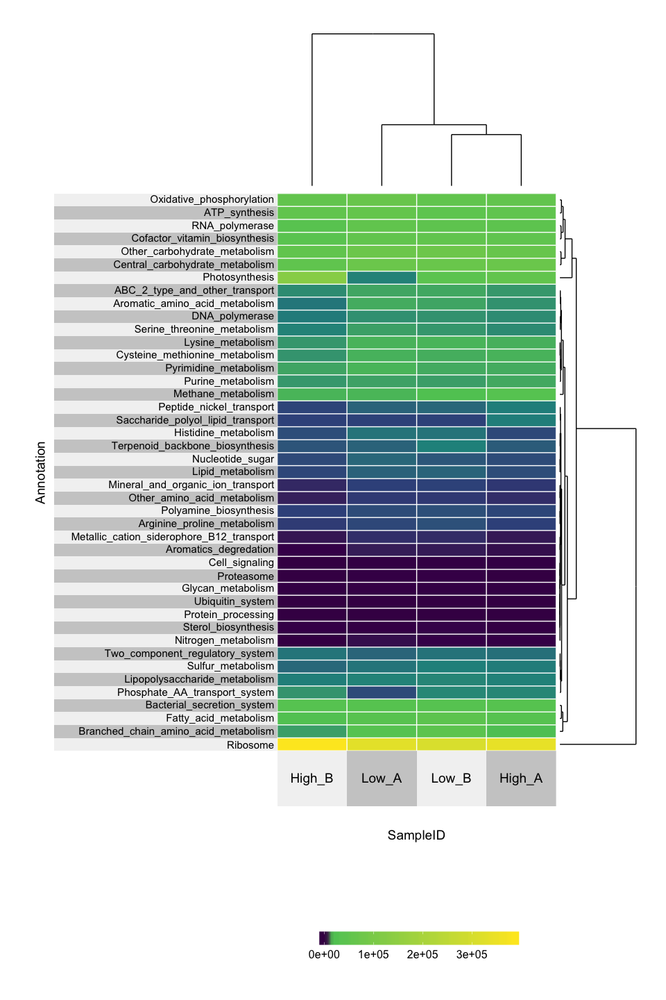

Speeding-up-science-metatranscriptomics-function-summary
================
Zeya Xue
5/10/2019

Load packages and setting up
----------------------------

``` r
library(superheat)
```

Import normalized KEGG module file
----------------------------------

``` r
# The otu table slot of phyloseq object 
KeggTPM <- read.table(file.path("example_data/KEGG_module_TPM.tsv"),
                      header = TRUE, sep = "\t")
row.names(KeggTPM) <- KeggTPM$KEGG_module
KeggTPM <- KeggTPM[,-1]
KeggTPM <- as.matrix.data.frame(KeggTPM)
```

Heat map
--------

``` r
superheat(KeggTPM,
          # retain original order of rows/cols
          pretty.order.rows = TRUE,
          pretty.order.cols = TRUE,
          row.dendrogram = TRUE,
          col.dendrogram = TRUE,
          grid.hline = TRUE,
          row.title = "Annotation",
          column.title = "SampleID",
          left.label.text.size = 4,
          bottom.label.text.size = 5,
          left.label.size = 0.8,
          # change the grid color to white (more pretty on a dark background)
          grid.hline.col = "white",
          grid.vline.col = "white") 
```

    ## Warning: package 'bindrcpp' was built under R version 3.4.4


