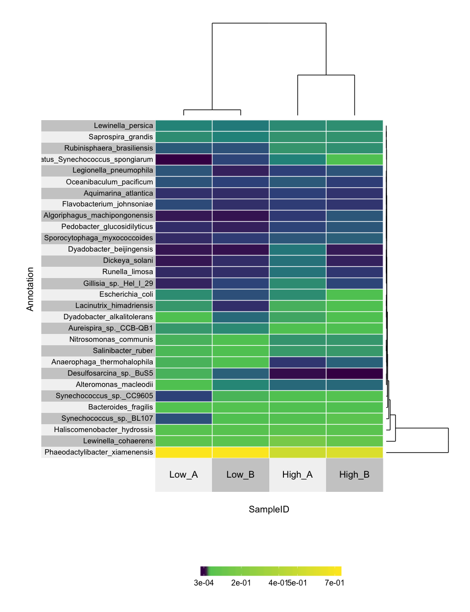

Speeding-up-science-metatranscriptomics-taxa-summary
================
Zeya Xue
5/9/2019

Written by Zhengyao "Zeya" Xue, [ORCID](https://orcid.org/0000-0002-4930-8212)

Introduction
------------

-   The starting point of the workflow is
-   A count table, normalized or not. Looks like this:

<!-- -->

    ##      CDS_ID     Low_A    Low_B   High_A   High_B
    ## 1   CDS_100 10.980509 8.364332 28.15585 0.000000
    ## 2 CDS_10011  2.284764 1.522854 10.25240 0.000000
    ## 3 CDS_10013  9.833839 6.554506  0.00000 0.000000
    ## 4 CDS_10015  7.194288 2.501831  0.00000 0.000000
    ## 5 CDS_10016  0.000000 0.000000 44.98916 0.000000
    ## 6 CDS_10017 18.738610 6.516398  0.00000 7.725487

-   A annotation or taxonomy table

<!-- -->

    ##      CDS_ID KO_ID  Domain        Phylum           Class              Order
    ## 1  CDS_2383  <NA> Archaea Euryarchaeota    Methanococci    Methanococcales
    ## 2  CDS_4184  <NA> Archaea Euryarchaeota Methanomicrobia  Methanosarcinales
    ## 3  CDS_6601  <NA> Archaea Euryarchaeota Methanomicrobia  Methanosarcinales
    ## 4  CDS_6904  <NA> Archaea Euryarchaeota    Methanococci    Methanococcales
    ## 5  CDS_7927  <NA> Archaea Euryarchaeota    Halobacteria       Natrialbales
    ## 6 CDS_15355  <NA> Archaea Euryarchaeota Methanomicrobia Methanomicrobiales
    ##                  Family              Genus                     Species
    ## 1 Methanocaldococcaceae Methanocaldococcus Methanocaldococcus_infernus
    ## 2    Methanosarcinaceae     Methanosarcina      Methanosarcina_barkeri
    ## 3    Methanosarcinaceae     Methanosarcina      Methanosarcina_barkeri
    ## 4      Methanococcaceae      Methanococcus     Methanococcus_vannielii
    ## 5         Natrialbaceae      Haloterrigena      Haloterrigena_jeotgali
    ## 6   Methanomicrobiaceae     Methanolacinia  Methanolacinia_petrolearia

-   A sample metainfo table

<!-- -->

    ##   SampleID Place Group
    ## 1   High_A  High     A
    ## 2   High_B  High     B
    ## 3    Low_A   Low     A
    ## 4    Low_B   Low     B

-   The demonstration shown here is using data from [this paper](https://aem.asm.org/content/84/1/e02026-17.short)

-   The data files and R scripts can be found in this [Binder-GitHub repo](https://github.com/zeyaxue/speeding-up-science-binder)

Load packages and setting up
----------------------------

``` r
library(phyloseq);packageVersion("phyloseq")
```

    ## [1] '1.22.3'

``` r
library(DESeq2);packageVersion("DESeq2")
```

    ## Loading required package: S4Vectors

    ## Loading required package: stats4

    ## Loading required package: BiocGenerics

    ## Loading required package: parallel

    ## 
    ## Attaching package: 'BiocGenerics'

    ## The following objects are masked from 'package:parallel':
    ## 
    ##     clusterApply, clusterApplyLB, clusterCall, clusterEvalQ,
    ##     clusterExport, clusterMap, parApply, parCapply, parLapply,
    ##     parLapplyLB, parRapply, parSapply, parSapplyLB

    ## The following objects are masked from 'package:stats':
    ## 
    ##     IQR, mad, sd, var, xtabs

    ## The following objects are masked from 'package:base':
    ## 
    ##     anyDuplicated, append, as.data.frame, cbind, colMeans,
    ##     colnames, colSums, do.call, duplicated, eval, evalq, Filter,
    ##     Find, get, grep, grepl, intersect, is.unsorted, lapply,
    ##     lengths, Map, mapply, match, mget, order, paste, pmax,
    ##     pmax.int, pmin, pmin.int, Position, rank, rbind, Reduce,
    ##     rowMeans, rownames, rowSums, sapply, setdiff, sort, table,
    ##     tapply, union, unique, unsplit, which, which.max, which.min

    ## 
    ## Attaching package: 'S4Vectors'

    ## The following object is masked from 'package:base':
    ## 
    ##     expand.grid

    ## Loading required package: IRanges

    ## 
    ## Attaching package: 'IRanges'

    ## The following object is masked from 'package:phyloseq':
    ## 
    ##     distance

    ## Loading required package: GenomicRanges

    ## Warning: package 'GenomicRanges' was built under R version 3.4.3

    ## Loading required package: GenomeInfoDb

    ## Loading required package: SummarizedExperiment

    ## Warning: package 'SummarizedExperiment' was built under R version 3.4.3

    ## Loading required package: Biobase

    ## Welcome to Bioconductor
    ## 
    ##     Vignettes contain introductory material; view with
    ##     'browseVignettes()'. To cite Bioconductor, see
    ##     'citation("Biobase")', and for packages 'citation("pkgname")'.

    ## 
    ## Attaching package: 'Biobase'

    ## The following object is masked from 'package:phyloseq':
    ## 
    ##     sampleNames

    ## Loading required package: DelayedArray

    ## Loading required package: matrixStats

    ## Warning: package 'matrixStats' was built under R version 3.4.3

    ## 
    ## Attaching package: 'matrixStats'

    ## The following objects are masked from 'package:Biobase':
    ## 
    ##     anyMissing, rowMedians

    ## 
    ## Attaching package: 'DelayedArray'

    ## The following objects are masked from 'package:matrixStats':
    ## 
    ##     colMaxs, colMins, colRanges, rowMaxs, rowMins, rowRanges

    ## The following object is masked from 'package:base':
    ## 
    ##     apply

    ## [1] '1.18.1'

``` r
library(ggplot2)
```

    ## Warning: package 'ggplot2' was built under R version 3.4.4

``` r
library(reshape2)
```

    ## Warning: package 'reshape2' was built under R version 3.4.3

``` r
library(superheat)
library(plyr)
```

    ## 
    ## Attaching package: 'plyr'

    ## The following object is masked from 'package:matrixStats':
    ## 
    ##     count

    ## The following object is masked from 'package:IRanges':
    ## 
    ##     desc

    ## The following object is masked from 'package:S4Vectors':
    ## 
    ##     rename

``` r
library(dplyr)
```

    ## Warning: package 'dplyr' was built under R version 3.4.4

    ## 
    ## Attaching package: 'dplyr'

    ## The following objects are masked from 'package:plyr':
    ## 
    ##     arrange, count, desc, failwith, id, mutate, rename, summarise,
    ##     summarize

    ## The following object is masked from 'package:matrixStats':
    ## 
    ##     count

    ## The following object is masked from 'package:Biobase':
    ## 
    ##     combine

    ## The following objects are masked from 'package:GenomicRanges':
    ## 
    ##     intersect, setdiff, union

    ## The following object is masked from 'package:GenomeInfoDb':
    ## 
    ##     intersect

    ## The following objects are masked from 'package:IRanges':
    ## 
    ##     collapse, desc, intersect, setdiff, slice, union

    ## The following objects are masked from 'package:S4Vectors':
    ## 
    ##     first, intersect, rename, setdiff, setequal, union

    ## The following objects are masked from 'package:BiocGenerics':
    ## 
    ##     combine, intersect, setdiff, union

    ## The following objects are masked from 'package:stats':
    ## 
    ##     filter, lag

    ## The following objects are masked from 'package:base':
    ## 
    ##     intersect, setdiff, setequal, union

Import files to create phyloseq object
--------------------------------------

``` r
# The otu table slot of phyloseq object 
TabTPM <- read.table(file.path("example_data/sample_TPM.tsv"),
                     header = TRUE, sep = "\t")
row.names(TabTPM) <- TabTPM$CDS_ID
TabTPM <- TabTPM[,-1]
TabTPM <- as.matrix.data.frame(TabTPM)

# The tax table slot of phyloseq object
Tabanno <- read.table(file.path("example_data/sample_annotation_classifications.tsv"),
                      header = TRUE, sep = "\t", na.strings = "<NA>")
rownames(Tabanno) <- Tabanno$CDS_ID
Tabanno <- Tabanno[,c(-1,-2)] # remove CDS_ID and KOID
Tabanno <- as.matrix.data.frame(Tabanno)

# The sample data slot of phyloseq object
samdf <- read.csv(file.path("example_data/Samdf.csv"))
```

    ## Warning in read.table(file = file, header = header, sep = sep, quote =
    ## quote, : incomplete final line found by readTableHeader on 'example_data/
    ## Samdf.csv'

``` r
rownames(samdf) <- samdf$SampleID

ps <- phyloseq(otu_table(TabTPM, taxa_are_rows = TRUE), 
               tax_table(Tabanno), sample_data(samdf))
ps # 20000 taxa and 4 samples
```

    ## phyloseq-class experiment-level object
    ## otu_table()   OTU Table:         [ 20000 taxa and 4 samples ]
    ## sample_data() Sample Data:       [ 4 samples by 3 sample variables ]
    ## tax_table()   Taxonomy Table:    [ 20000 taxa by 7 taxonomic ranks ]

Optional taxonomy level clean up
--------------------------------

``` r
# Define function to get the deepest taxa assignment level
RECps <- function(ps) {
  TaxTab2 <- as.data.frame(ps@tax_table)
  
  list.s = as.character(TaxTab2$Species)
  list.g = as.character(TaxTab2$Genus)
  list.f = as.character(TaxTab2$Family)
  list.o = as.character(TaxTab2$Order)
  list.c = as.character(TaxTab2$Class)
  list.p = as.character(TaxTab2$Phylum)
  list.k = as.character(TaxTab2$Kingdom)
  list.d = as.character(TaxTab2$Domain)
  list.REC = character(length(as.character(TaxTab2$Species)))
  
  for(i in 1:dim(TaxTab2)[1]){
    S = which(TaxTab2$Species[i] == "")
    G = which(TaxTab2$Genus[i] == "")
    F = which(TaxTab2$Family[i] == "")
    O = which(TaxTab2$Order[i] == "")
    C = which(TaxTab2$Class[i] == "")
    P = which(TaxTab2$Phylum[i] == "")
    K = which(TaxTab2$Kingdom[i] == "")
    D = which(TaxTab2$Domain[i] == "")
    if(length(S) == 0){
      list.REC[i] <- list.s[i]
    } else if(length(G) == 0){
      list.REC[i] <- list.g[i]
    } else if(length(F) == 0){
      list.REC[i] <- list.f[i]
    } else if(length(O) == 0){
      list.REC[i] <- list.o[i]
    } else if(length(C) == 0){
      list.REC[i] <- list.c[i]
    } else if(length(P) == 0){
      list.REC[i] <- list.p[i]
    } else if(length(K) == 0){
      list.REC[i] <- list.k[i]
    } else if(length(D) == 0){
      list.REC[i] <- list.d[i]
    } else
      list.REC[i] <- "meow"
  }
  
  TaxTab2$REC <- list.REC
  TaxTab2$REC <- factor(TaxTab2$REC)
  merge_phyloseq(ps, TaxTab2 %>% as.matrix() %>% tax_table())
}

ps.REC <- RECps(ps)
ps.REC # 20000 taxa and 4 samples 
```

    ## phyloseq-class experiment-level object
    ## otu_table()   OTU Table:         [ 20000 taxa and 4 samples ]
    ## sample_data() Sample Data:       [ 4 samples by 3 sample variables ]
    ## tax_table()   Taxonomy Table:    [ 20000 taxa by 8 taxonomic ranks ]

Heat map
--------

``` r
# Run the next line if want relative abundance 
ps.REC.per <- ps.REC %>% transform_sample_counts(function(x) x/sum(x) )  
# Clean up the taxonomy 
ps.REC.glom <- ps.REC.per %>% tax_glom(taxrank = "REC", NArm = FALSE)
taxa.df <- psmelt(ps.REC.glom)  # melt ps object 
# aggregate for REC level plot
taxa.agg <- aggregate(Abundance ~ REC + SampleID,
                      data = taxa.df,
                      mean)
taxa.cast <- dcast(taxa.agg, REC ~ SampleID, mean, value.var = "Abundance")

# Define palette 
my_palette <- colorRampPalette(c("red", "yellow", "green"))(n = 299)
# defines the color breaks manually for a "skewed" color transition
col_breaks = c(seq(-1,0,length=100),      # for red
               seq(0.01,0.8,length=100),  # for yellow
               seq(0.81,1,length=100))    # for green

# only plot the top 30 most abundant taxa 
# need to change results from factor to numeric because of R
row.names(taxa.cast) <- taxa.cast$REC
taxa.cast <- taxa.cast[, -1]
indx <- sapply(taxa.cast, is.factor)
taxa.cast[indx] <- lapply(taxa.cast[indx], function(x) as.numeric(as.character(x))) 
taxa.cast30 <- cbind(taxa.cast, total = rowSums(taxa.cast)) #  need numeric values
taxa.cast30$taxa <- rownames(taxa.cast30)
taxa.cast30 <- head(arrange(taxa.cast30,desc(total)), n = 30)
```

    ## Warning: package 'bindrcpp' was built under R version 3.4.4

``` r
row.names(taxa.cast30) <- taxa.cast30$taxa
taxa.cast30 <- taxa.cast30[, -c(5,6)] # remove total and taxa name colums
  
superheat(taxa.cast30,
          # retain original order of rows/cols
          pretty.order.rows = TRUE,
          pretty.order.cols = TRUE,
          row.dendrogram = TRUE,
          col.dendrogram = TRUE,
          grid.hline = TRUE,
          row.title = "Annotation",
          column.title = "SampleID",
          left.label.text.size = 4,
          bottom.label.text.size = 5,
          left.label.size = 0.5,
          # change the grid color to white (more pretty on a dark background)
          grid.hline.col = "white",
          grid.vline.col = "white") 
```


